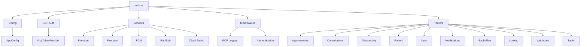

# Backend/API Codemap

**Last Updated:** 2026-03-02
**Entry Points:** `/server/src/main.rs` - Doctor App bootstrap; `/doctor-pool/src/main.rs` - Doctor Pool bootstrap

## Architecture

Core service architecture with dependency injection, repository pattern, and external service integration.



## Workspace Services

### Doctor App (`server`)

The `server` crate remains the healthcare API gateway for doctor-facing
appointment, consultation, onboarding, notification, profile, timeslot,
backoffice, and legacy ranking routes.

### Doctor Pool (`doctor-pool`)

The `doctor-pool` crate owns patient-facing doctor pool search and ranking.
It exposes:

```text
GET /health
GET /doctor-pool/v1/doctors/instant
GET /doctor-pool/v1/doctors/scheduled
GET /doctor-pool/v1/doctors/{doctorUuid}
```

Search supports optional privilege filters:

```text
?privilegeId=9001
?privilegeId=9001&privilegeId=9002
?privilegeIds=9001,9002
```

No privilege IDs means the ranked pool is returned without privilege filtering.
One or more privilege IDs means strict filtering by departments eligible for at
least one supplied privilege.

Ranking still applies after pool and privilege eligibility are resolved:

- Instant pool: `instant_mode_enabled = true`
- Scheduled pool: `schedule_mode_enabled = true`
- Sort: `score DESC`, then `doctor_id DESC`
- Pagination: cursor token based on score and UUID

The crate includes in-memory adapters for local development/tests and
production-facing Redis/PostgreSQL adapters:

- `RankingIndex`: Redis sorted sets for fast instant/scheduled ranked IDs.
- `DoctorProjectionRepo`: denormalized doctor display/search read model. The
  runtime profile source is `doctor_profile` only; `doctor_profile_draft` is
  used only as a reference template for mock data inserted into
  `doctor_profile`.
- `EligibilityReadModel`: synced `privilegeId -> departmentId[]` read model.

At startup, `doctor-pool` uses `DATABASE_URL` and `REDIS_URL` to load active
doctors from `doctor_profile` and warm Redis sorted sets. Mock profile data uses
the draft-shaped fields but is read from `doctor_profile`; `doctor_account_id`
maps to a deterministic UUID such as
`a0000012-0012-4000-8000-000000000012` for account `12`. It exposes internal
update routes for doctor upserts, instant booking availability, and privilege
department mapping updates.

## Core Components

### Configuration
- **Location**: `server/src/config/`
- **Pattern**: Environment variable overrides with `__` separator
- **Key Configs**: `http_server.port`, `firestore.gcp_project_id`, `service.iam_gatekeeper_base_uri`

### Authentication & Identity
- **Headers**: `tdh-sec-iam-user-identity` (JSON UserIdentity)
- **Extractors**:
  - `DoctorIdentity`: Requires canonical doctor `account_type == 2` and extracts `doctor_account_id` (`account_type == 3` is accepted only for legacy compatibility)
  - `BackofficeIdentity`: Requires `account_type == 4`
  - `PatientHeaders`: Reads patient account/profile IDs
- **Trust Model**: Up gateway trusted, no token validation

### Error Handling
- **Location**: `server/src/core/error.rs`
- **Type**: `AppError` enum with `IntoResponse` implementation
- **Pattern**: `AppResult<T>` alias for `Result<T, AppError>`
- **Domain Errors**: HTTP 200 with `__type` field
- **HTTP Errors**: 4xx/5xx for protocol issues

## Repository Layer

### Generic Repositories

#### FirestoreRepo
- **Location**: `server/src/repo/firestore.rs`
- **Purpose**: Generic Firestore CRUD operations
- **Features**:
  - Collections and subcollections
  - Query with filters (`QueryOp`)
  - Ordering and pagination
  - Batch updates
- **Usage**: Wrapped by module-specific repositories

#### FirebaseRepo
- **Location**: `server/src/repo/firebase.rs`
- **Purpose**: Firebase Realtime Database REST API
- **Features**:
  - Token caching (3500s TTL)
  - JSON serialization
  - Error handling

### Module Repositories

| Repository | Location | Base Repository | Purpose |
|------------|----------|----------------|---------|
| `OnBoardingRepo` | `onboarding/repo.rs` | FirestoreRepo | Doctor profile management |
| `NotificationRepo` | `notification/repo.rs` | FirestoreRepo | Push notifications |
| `AppointmentRepo` | `appointment/repo.rs` | FirestoreRepo | Appointment CRUD |
| `ConsultationRepo` | `consultation/repo.rs` | FirestoreRepo | Consultation states |

## Dependency Injection Pattern

### Shared Repositories
```rust
// onboarding and user share a repository
let (onboarding_router, onboarding_repo) = module::onboarding::router(firestore.clone(), &cfg);
let user_router = module::user::router(onboarding_repo);  // re-use

// notification and webhook share a repository
let (notification_router, notification_repo) = module::notification::router(firestore.clone(), &cfg);
let webhook_router = module::webhook::router(notification_repo, fcm_service);
```

### Service Injection
```rust
// Services are wrapped in Arc and passed via State
struct AppState {
    firestore: Arc<FirestoreRepo>,
    firebase: Arc<FirebaseRepo>,
    fcm: Arc<FcmService>,
    pubsub: Arc<PubSubPublisher>,
}
```

## Module Architecture

Each module follows the same structure:

```
module/
├── mod.rs          # pub fn router(...)
├── handlers.rs     # Axum handlers
├── repo.rs         # Repository trait (optional)
└── service.rs      # Service layer (optional)
```

### Module Initialization
```rust
// mod.rs
pub fn router(
    firestore: Arc<FirestoreRepo>,
    config: &AppConfig,
) -> (Router, Arc<dyn Trait>) {
    // Initialize repository
    let repo = ModuleRepoImpl::new(firestore);

    // Create router
    let router = Router::new()
        .route("/path", post(handler))
        .with_state(repo);

    (router, repo.into())
}
```

## External Services Integration

### GCP Authentication
- **Location**: `server/src/core/gcp_auth.rs`
- **Provider**: `GcpTokenProvider`
- **Credentials**: Application Default Credentials (ADC)
- **Auto-refresh**: Handles token refresh for all GCP services

### Cloud Pub/Sub
- **Location**: `server/src/module/webhook/pubsub.rs`
- **Purpose**: Event publishing to external services
- **Topics**: appointments, consultations, system, broadcast
- **Configuration**: `pubsub.topics.*` in config

### Cloud Tasks
- **Location**: `server/src/module/webhook/cloud_tasks.rs`
- **Purpose**: Delayed job execution
- **Configuration**: `cloud_tasks.*` in config
- **Emulator**: Set `CLOUD_TASKS__EMULATOR_HOST`

### Firebase Cloud Messaging
- **Location**: `server/src/module/notification/fcm.rs`
- **Purpose**: Push notification delivery
- **Features**: Topic subscriptions, individual device targeting

### HTTP Clients
- **Patient Service**: IAM gatekeeper profile lookup
- **IAM Gatekeeper**: Internal profile API

## Data Flow

### Request Lifecycle
1. **Incoming Request**: GCP logging middleware adds correlation ID
2. **Authentication**: Header extraction and identity parsing
3. **Route Matching**: Axum router selects handler
4. **Repository Access**: Data layer operations
5. **Response**: JSON serialization with proper headers

### Event Processing
1. **Event Trigger**: External system or internal state change
2. **Pub/Sub Publishing**: Event sent to appropriate topic
3. **Cloud Task Creation**: Delayed tasks scheduled
4. **Task Execution**: Handler processes event
5. **State Update**: Database operations performed

## Configuration Management

### Environment Variables
| Variable | Config Key | Description |
|----------|------------|-------------|
| `HTTP_SERVER__PORT` | `http_server.port` | Server port (default: 8080) |
| `FIRESTORE__GCP_PROJECT_ID` | `firestore.gcp_project_id` | Firestore project |
| `SERVICE__IAM_GATEKEEPER_BASE_URI` | `service.iam_gatekeeper_base_uri` | IAM gatekeeper URL |
| `FIREBASE__DATABASE_SECRET` | `firebase.database_secret` | Firebase auth secret |

### Local Development
- **Secrets**: `server/.env` file (loaded via dotenvy)
- **GCP Auth**: `gcloud auth application-default login`
- **Emulators**: Set emulator host variables

## Security Considerations

### TLS Crypto Provider
- **Required**: Explicit `aws-lc-rs` installation in `main.rs`
- **Reason**: Avoid auto-detection conflicts with `ring`
- **Impact**: All TLS operations use AWS-LC crypto

### Data Protection
- **Logging**: Sensitive data masked in query strings
- **Headers**: Request correlation with trace ID
- **Authentication**: Header-based with upstream trust

## Performance Optimizations

### Caching
- **Firebase Token**: 3500s TTL cached token
- **Repository Wrapping**: Arc<dyn Trait> for shared instances
- **Query Optimization**: Firestore indexing via `firestore.indexes.json`

### Concurrency
- **Async/Await**: Tokio runtime throughout
- **Shared State**: Arc-based sharing
- **Connection Pooling**: HTTP clients and database connections
