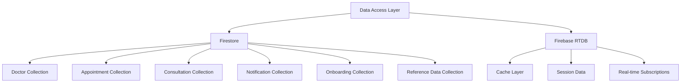

# Database Codemap

**Last Updated:** 2026-03-02

## Architecture

Dual-database architecture using Google Firestore as primary storage and Firebase Realtime Database for secondary storage and caching.



## Firestore Collections

### 1. Doctor Collection
**Path**: `doctors/{doctorId}`
**Purpose**: Doctor profile and account information

**Schema**:
```typescript
{
  doctor_account_id: number,
  account_type: number,           // 2 = Doctor, 4 = Backoffice
  first_name: string,
  last_name: string,
  email: string,
  phone: string,
  profile_picture_url: string,
  specialty: string,
  registration_completed: boolean,
  created_at: Timestamp,
  updated_at: Timestamp
}
```

### 2. Appointment Collection
**Path**: `appointments/{appointmentId}`
**Purpose**: Doctor appointment scheduling and management

**Schema**:
```typescript
{
  appointment_id: string,
  doctor_account_id: number,
  patient_account_id: number,
  patient_profile_id: number,
  start_time: Timestamp,
  end_time: Timestamp,
  status: 'scheduled' | 'completed' | 'cancelled' | 'no_show',
  consultation_channel: string,
  notes: string,
  created_at: Timestamp,
  updated_at: Timestamp
}
```

### 3. Consultation Collection
**Path**: `consultations/{consultationId}`
**Purpose**: Consultation state management and event tracking

**Schema**:
```typescript
{
  consultation_id: string,
  appointment_id: string,
  doctor_account_id: number,
  patient_account_id: number,
  state: 'booking' | 'started' | 'completed' | 'cancelled',
  events: Array<{
    type: string,
    data: any,
    timestamp: Timestamp
  }>,
  video_url: string,
  created_at: Timestamp,
  updated_at: Timestamp
}
```

### 4. Notification Collection
**Path**: `notifications/{notificationId}`
**Purpose**: Push notification delivery tracking

**Schema**:
```typescript
{
  notification_id: string,
  doctor_account_id: number,
  type: 'appointment_reminder' | 'consultation_update' | 'system',
  title: string,
  message: string,
  fcm_token: string,
  status: 'pending' | 'delivered' | 'failed',
  created_at: Timestamp,
  updated_at: Timestamp
}
```

### 5. Onboarding Collection
**Path**: `onboarding/{doctor_account_id}`
**Purpose**: Doctor profile setup progress tracking

**Schema**:
```typescript
{
  doctor_account_id: number,
  step: 'basic_info' | 'documents' | 'specialty' | 'banking',
  data: any,                      // Step-specific data
  documents: Array<{
    type: string,
    url: string,
    status: 'uploaded' | 'verified' | 'rejected'
  }>,
  completed: boolean,
  created_at: Timestamp,
  updated_at: Timestamp
}
```

### 6. Reference Data Collection
**Path**: `reference_data/{category}/{id}`
**Purpose**: Static lookup data for onboarding

**Categories**:
- `provinces`
- `districts` (parent: province_id)
- `sub_districts` (parent: district_id)
- `postal_codes` (parent: sub_district_id)
- `hospitals`
- `universities`
- `professions`
- `academic_positions`
- `medical_schools`

**Schema**:
```typescript
{
  id: string,
  name_th: string,
  name_en: string,
  parent_id: string,       // For hierarchical data
  order: number,
  is_active: boolean,
  created_at: Timestamp,
  updated_at: Timestamp
}
```

## Firebase Realtime Database

### Usage Patterns
- **Caching**: Frequently accessed data
- **Real-time**: Live updates for notifications
- **Session Data**: Temporary state during operations

### Structure
```json
{
  "cache": {
    "doctors": {
      "doctorId": { ... }
    },
    "reference_data": {
      "provinces": { ... }
    }
  },
  "sessions": {
    "doctor_sessions": {
      "session_id": {
        "doctor_id": number,
        "last_activity": Timestamp
      }
    }
  }
}
```

## Data Relationships

### 1. Doctor → Appointments
- **One-to-Many**: One doctor has many appointments
- **Reference**: `appointments.doctor_account_id` → `doctors.doctor_account_id`

### 2. Doctor → Consultations
- **One-to-Many**: One doctor has many consultations
- **Reference**: `consultations.doctor_account_id` → `doctors.doctor_account_id`

### 3. Appointment → Consultation
- **One-to-One**: One appointment corresponds to one consultation
- **Reference**: `consultations.appointment_id` → `appointments.appointment_id`

### 4. Geographic Hierarchy
```
Province → District → SubDistrict → PostalCode
```

## Data Access Patterns

### Repository Pattern
```rust
// Generic repository interface
pub trait FirestoreRepo {
    async fn create<T: Serialize>(&self, path: &str, data: T) -> AppResult<DocumentId>;
    async fn get<T: DeserializeOwned>(&self, path: &str, id: &str) -> AppResult<T>;
    async fn update<T: Serialize>(&self, path: &str, id: &str, data: T) -> AppResult<()>;
    async fn delete(&self, path: &str, id: &str) -> AppResult<()>;
    async fn query<T: DeserializeOwned>(&self, path: &str, queries: Vec<QueryOp>) -> AppResult<Vec<T>>;
}

// Module-specific implementations
pub struct AppointmentRepo {
    firestore: Arc<FirestoreRepo>,
}

impl AppointmentRepo {
    pub async fn create(&self, appointment: NewAppointment) -> AppResult<Appointment> {
        self.firestore.create("appointments", appointment).await
    }
}
```

### Query Operations
```rust
// Query filters
enum QueryOp {
    Eq(String, Value),          // Equal to
    Ne(String, Value),         // Not equal to
    Gt(String, Value),         // Greater than
    Lt(String, Value),         // Less than
    In(String, Vec<Value>),    // In array
    Order(String, bool),       // Sort field, descending
    Limit(usize),              // Limit results
    Cursor(String),            // Pagination cursor
}
```

## Data Consistency

### Write Strategies
1. **Firestore**: Primary source of truth for structured data
2. **Firebase**: Secondary storage for real-time needs
3. **Batch Operations**: Multi-document transactions where needed

### Error Handling
- **Optimistic Locking**: Firestore document version checks
- **Retry Logic**: For transient failures
- **Fallback Data**: Firebase cache when Firestore unavailable

## Indexing

### Firestore Indexes
Defined in `firestore.indexes.json`:
```json
{
  "indexes": [
    {
      "collectionGroup": "appointments",
      "queryScope": "COLLECTION",
      "fields": [
        {"fieldPath": "doctor_account_id", "order": "ASCENDING"},
        {"fieldPath": "start_time", "order": "ASCENDING"}
      ]
    }
  ]
}
```

### Common Query Patterns
1. **Doctor's Appointments**: `doctor_account_id` + `start_time` index
2. **Date Range Queries**: Time-based indexes for scheduling
3. **Status Filtering**: Status field indexes for filtering
4. **Geographic Lookups**: Hierarchical data for location-based queries

## Data Migration

### Version Control
- **Schema Changes**: Backward-compatible design
- **Rollback Strategy**: Versioned collections when needed
- **Data Validation**: Runtime type checking

### Migration Patterns
```rust
// Schema migration example
pub async fn migrate_v1_to_v2(firestore: &FirestoreRepo) -> AppResult<()> {
    // 1. Read all documents
    let doctors = firestore.query::<Doctor>("doctors", vec![]).await?;

    // 2. Transform data
    for doctor in doctors {
        let v2_doctor = DoctorV2::from_v1(doctor);
        // 3. Write updated version
        firestore.update("doctors", &v2_doctor.id, v2_doctor).await?;
    }

    Ok(())
}
```

## Performance Considerations

### Caching Strategy
- **Reference Data**: Cached in Firebase for fast access
- **Doctor Profiles**: Frequently accessed doctors cached
- **Session Data**: Temporary state in Firebase

### Query Optimization
- **Select Fields**: Only query needed fields
- **Pagination**: Cursor-based for large datasets
- **Batch Operations**: Multiple documents in single request

## Security

### Access Control
- **Firestore Security Rules**: Define collection/document access
- **Firebase Rules**: Real-time database access control
- **Application Layer**: Authentication via headers

### Data Protection
- **PII Masking**: In logging and responses
- **Encryption**: At rest and in transit
- **Audit Trail**: Change tracking for sensitive operations
