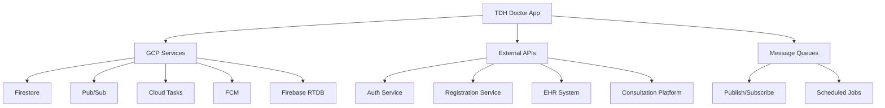

# Integrations Codemap

**Last Updated:** 2026-03-02
**Entry Points:** Various service modules in `server/src/module/`

## Architecture

External service integration layer with GCP services and third-party APIs.



## Cross-system integration guides

- [DoctorApp–APMv2 integration](../contracts/doctorapp-apmv2-integration.md) — canonical ownership, API, and event-contract overview.

## GCP Services Integration

### 1. Google Cloud Firestore
**Location**: `server/src/repo/firestore.rs`
**Purpose**: Primary data storage

**Features**:
- CRUD operations for all business entities
- Complex queries with filters and pagination
- Transaction support for multi-document operations
- Automatic retry with exponential backoff

**Configuration**:
```toml
[firestore]
gcp_project_id = "your-project-id"
```

**Usage**:
```rust
let firestore = FirestoreRepo::new(&config.firestore).await?;
let appointment = firestore.create("appointments", new_appointment).await?;
```

### 2. Cloud Pub/Sub
**Location**: `server/src/module/webhook/pubsub.rs`
**Purpose**: Event publishing and messaging

**Features**:
- Async message publishing
- Topic-based routing
- Batch message support
- Error handling and retries

**Topics**:
- `appointments`: Appointment-related events
- `consultations`: Consultation state changes
- `system`: System events
- `broadcast`: General notifications

**Configuration**:
```toml
[pubsub]
topics = { appointments = "projects/project/topics/appointments" }
```

**Usage**:
```rust
let publisher = PubSubPublisher::new(&config.pubsub)?;
publisher.publish("appointments", event).await?;
```

### 3. Cloud Tasks
**Location**: `server/src/module/webhook/cloud_tasks.rs`
**Purpose**: Delayed job execution

**Features**:
- HTTP task scheduling
- Retry mechanism with exponential backoff
- Deadline handling
- Queue management

**Configuration**:
```toml
[cloud_tasks]
project = "your-project"
location = "us-central1"
queue = "default"
```

**Usage**:
```rust
let client = CloudTasksClient::new(&config.cloud_tasks)?;
let task = client.create_http_task(url, delay, payload).await?;
```

### 4. Firebase Cloud Messaging (FCM)
**Location**: `server/src/module/notification/fcm.rs`
**Purpose**: Push notification delivery

**Features**:
- Device token management
- Topic subscription
- Message prioritization
- Analytics tracking

**Configuration**:
```toml
[fcm]
project_id = "your-project"
service_account_key = "/path/to/key.json"
```

**Usage**:
```rust
let fcm = FcmService::new(&config.fcm)?;
fcm.send_notification(token, message).await?;
```

### 5. Firebase Realtime Database
**Location**: `server/src/repo/firebase.rs`
**Purpose**: Secondary storage and caching

**Features**:
- Real-time data synchronization
- Token-based authentication
- JSON document storage
- TTL caching for tokens

**Configuration**:
```toml
[firebase]
database_url = "https://project-id.firebaseio.com"
database_secret = "your-secret"
token_ttl = 3500  # seconds
```

## External API Integrations

### 1. IAM Gatekeeper
**Purpose**: User identity/profile lookup
**Base URI**: Configurable via `service.iam_gatekeeper_base_uri`

**Usage**:
```rust
// Header-based authentication (no direct calls)
// Doctor identity uses canonical account_type == 2 in `tdh-sec-iam-user-identity`
let identity = DoctorIdentity::extract(headers)?;
```

### 2. Patient Profile Lookup
**Location**: `server/src/module/patient/service.rs`
**Purpose**: Patient data retrieval via IAM gatekeeper

**Features**:
- Patient profile fetching
- Fallback name generation
- Error handling and retry logic

**Configuration**:
```toml
[service]
registration_service_base_uri = "https://registration-service.example.com"
```

**Usage**:
```rust
let patient_service = PatientService::new(config.registration_service_base_uri);
let name = patient_service.get_patient_name(patient_id, profile_id).await?;
```

### 3. EHR System
**Purpose**: Electronic health records integration
**Status**: Placeholder for future implementation

**Planned Features**:
- Medical record retrieval
- Clinical data exchange
- Lab results integration

### 4. Consultation Platform
**Purpose**: Video/audio call management
**Status**: Placeholder for future implementation

**Planned Features**:
- Meeting URL generation
- Call state tracking
- Recording management

## Message Publishing Patterns

### Event Structure
```rust
pub struct Event<T> {
    pub event_type: String,
    pub data: T,
    pub timestamp: DateTime,
    pub source: String,
}
```

### Common Event Types

#### Appointment Events
- `AppointmentCreated`: New appointment scheduled
- `AppointmentCancelled`: Appointment cancelled
- `AppointmentCompleted`: Appointment finished

#### Consultation Events
- `ConsultationStarted`: Consultation begins
- `ConsultationCompleted`: Consultation ends
- `ConsultationCancelled`: Consultation cancelled

#### System Events
- `DoctorOnboarded`: New doctor profile created
- `NotificationSent`: Push notification delivered
- `ErrorOccurred`: System error event

### Subscription Patterns

#### Event Handling
```rust
// Pub/Sub subscription setup
let subscriber = Subscriber::new("projects/project/subscriptions/my-sub");
let message = subscriber.receive().await?;

// Process message
let event: AppointmentEvent = serde_json::from_str(&message.data)?;
match event.event_type {
    "AppointmentCreated" => handle_appointment_created(event.data),
    "AppointmentCancelled" => handle_appointment_cancelled(event.data),
    _ => log!("Unknown event type"),
}
```

## Error Handling and Retries

### Retry Strategy
```rust
pub struct RetryConfig {
    max_attempts: u32,
    base_delay: Duration,
    max_delay: Duration,
    backoff_factor: f64,
}

impl RetryConfig {
    pub async fn execute<F, T>(&self, operation: F) -> Result<T, Error>
    where
        F: Fn() -> Fut,
        Fut: Future<Output = Result<T, Error>>,
    {
        // Exponential backoff implementation
    }
}
```

### Error Classification
- **Transient**: Network issues, temporary service unavailability
- **Permanent**: Invalid input, authentication failures
- **Retryable**: Transient with retry logic
- **Non-retryable**: Permanent errors logged and skipped

## Monitoring and Observability

### Metrics Tracking
- **Message Publish Success/Failure**
- **Task Execution Times**
- **API Response Latency**
- **Error Rates by Service**

### Logging
- **Structured JSON**: GCP Cloud Logging format
- **Correlation IDs**: Request tracking across services
- **Error Context**: Service-specific error details

### Distributed Tracing
- **OpenTelemetry**: Trace context propagation
- **GCP Cloud Trace**: Integration with Google Cloud
- **Span Creation**: Operation-level tracking

## Configuration Management

### Environment Variables
| Variable | Service | Purpose |
|----------|---------|---------|
| `GOOGLE_APPLICATION_CREDENTIALS` | All GCP | Service account path |
| `PUBSUB__EMULATOR_HOST` | Pub/Sub | Local emulator |
| `CLOUD_TASKS__EMULATOR_HOST` | Cloud Tasks | Local emulator |
| `TELEMETRY__EXPORTER_OTLP_ENDPOINT` | Tracing | OTLP collector |

### Local Development
```bash
# GCP emulator setup
export PUBSUB_EMULATOR_HOST=localhost:8085
export CLOUD_TASKS_EMULATOR_HOST=http://localhost:8123

# Application credentials
gcloud auth application-default login
```

## Security Considerations

### Service Authentication
- **Service Accounts**: GCP service account credentials
- **Token Refresh**: Automatic credential rotation
- **Least Privilege**: Minimal required permissions

### Data Encryption
- **Transport**: HTTPS for all external calls
- **At Rest**: GCP managed encryption
- **Tokens**: Secure storage and transmission

### Access Control
- **IAM Roles**: Principle of least privilege
- **VPC Service Controls**: Network boundaries
- **Audit Logging**: Access trail maintenance
