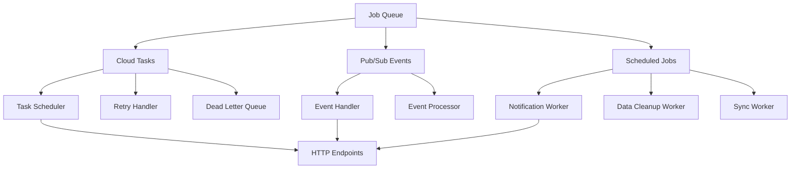

# Workers Codemap

**Last Updated:** 2026-03-02
**Entry Points:** `/server/src/module/webhook/` and `/server/src/module/notification/`

## Architecture

Background job processing system using Cloud Tasks for delayed execution and scheduled operations.



## Cloud Tasks Integration

### Task Configuration
**Location**: `server/src/module/webhook/cloud_tasks.rs`

**Features**:
- HTTP-based task execution
- Exponential backoff retries
- Deadline handling
- Queue management
- Dead letter queue support

**Task Structure**:
```rust
pub struct TaskRequest {
    pub task_id: String,
    pub payload: TaskPayload,
    pub retry_count: u32,
    pub deadline: Timestamp,
}
```

### Task Types

#### 1. Notification Delivery
**Endpoint**: `/tasks/v1/notifications/deliver`
**Purpose**: Send push notifications via FCM

**Payload**:
```rust
#[derive(Deserialize)]
pub struct NotificationTask {
    pub notification_id: String,
    pub fcm_token: String,
    pub message: NotificationMessage,
}
```

#### 2. Appointment Reminder
**Endpoint**: `/tasks/v1/appointments/remind`
**Purpose**: Send appointment reminders

**Payload**:
```rust
#[derive(Deserialize)]
pub struct AppointmentReminderTask {
    pub appointment_id: String,
    pub doctor_id: i32,
    pub patient_id: i32,
    pub reminder_time: DateTime,
}
```

#### 3. Data Cleanup
**Endpoint**: `/tasks/v1/data/cleanup`
**Purpose**: Remove old data and maintain storage

**Payload**:
```rust
#[derive(Deserialize)]
pub struct CleanupTask {
    pub collection: String,
    pub older_than: DateTime,
    pub dry_run: bool,
}
```

### Task Scheduling
```rust
// Schedule a delayed task
let task = cloud_tasks::create_http_task(
    "https://doctor-app.example.com/tasks/v1/notifications/deliver",
    Duration::from_secs(3600), // 1 hour delay
    notification_payload,
).await?;
```

## Event Processing Workers

### Pub/Sub Event Handler
**Location**: `server/src/module/webhook/`

**Features**:
- Event subscription and processing
- Error handling and retry
- Event correlation
- Dead letter handling

**Event Flow**:
```rust
// Event processing pipeline
async fn process_event(message: PubsubMessage) -> Result<(), Error> {
    // 1. Parse event type
    let event_type = &message.attributes.get("event_type")?;

    // 2. Validate event data
    let event_data = serde_json::from_str(&message.data)?;

    // 3. Process based on type
    match event_type {
        "AppointmentCreated" => handle_appointment_created(event_data).await,
        "ConsultationStarted" => handle_consultation_started(event_data).await,
        _ => log!("Unknown event type: {}", event_type),
    }
}
```

### Event Types and Handlers

#### Appointment Events
- **`AppointmentCreated`**: Schedule notification and prepare consultation
- **`AppointmentCancelled`**: Notify parties and cancel related tasks
- **`AppointmentCompleted`**: Update stats and send feedback request

#### Consultation Events
- **`ConsultationStarted`**: Begin monitoring session
- **`ConsultationCompleted`**: Update billing and records
- **`ConsultationCancelled`**: Cleanup resources and notify

#### System Events
- **`DoctorOnboarded`**: Setup initial data and preferences
- **`NotificationSent`**: Track delivery status
- **`ErrorOccurred`**: Log and alert on critical errors

## Scheduled Jobs

### Job Scheduler
**Location**: Various modules with Cloud Tasks integration

**Common Jobs**:
- **Hourly**: Data cleanup, stats aggregation
- **Daily**: Report generation, backups
- **Weekly**: System maintenance, data archiving

### Job Configuration
```rust
#[derive(Serialize)]
pub struct ScheduledJob {
    pub job_type: String,
    pub schedule: CronSchedule,
    pub payload: JobPayload,
    pub retry_policy: RetryPolicy,
}

#[derive(Serialize)]
pub struct RetryPolicy {
    pub max_attempts: u32,
    pub initial_delay: Duration,
    pub max_delay: Duration,
}
```

## Notification Workers

### FCM Notification Worker
**Location**: `server/src/module/notification/`

**Features**:
- Push notification delivery
- Device token management
- Topic subscription handling
- Analytics tracking

**Delivery Pipeline**:
```rust
async fn deliver_notification(
    fcm: &FcmService,
    notification: &Notification,
) -> Result<DeliveryResult, Error> {
    // 1. Validate device token
    if !is_valid_token(&notification.fcm_token) {
        return Err(InvalidTokenError);
    }

    // 2. Prepare message
    let message = FcmMessage::new(&notification.fcm_token, &notification.message);

    // 3. Send via FCM
    let response = fcm.send(message).await?;

    // 4. Handle response
    match response.status {
        FcmStatus::Success => Ok(DeliveryResult::Success),
        FcmStatus::InvalidToken => {
            // Mark token as invalid
            mark_token_invalid(&notification.fcm_token).await?;
            Err(DeliveryError::InvalidToken)
        }
        FcmStatus::RateLimited => Err(DeliveryError::RateLimited),
    }
}
```

### Batch Processing
```rust
// Process notifications in batches
async fn process_notification_batch(notifications: Vec<Notification>) {
    // Group by device token for batching
    let mut batches = HashMap::new();
    for notification in notifications {
        batches.entry(notification.fcm_token.clone())
            .or_insert_with(Vec::new)
            .push(notification);
    }

    // Process each batch
    for (token, batch) in batches {
        if let Err(e) = fcm.send_batch(token, batch).await {
            log_error!("Failed to send batch: {}", e);
        }
    }
}
```

## Error Handling and Retries

### Error Classification
```rust
pub enum WorkerError {
    // Network errors (retryable)
    NetworkError(reqwest::Error),

    // Authentication errors (not retryable)
    AuthenticationError,

    // Data validation errors (not retryable)
    ValidationError(String),

    // System errors (retryable)
    SystemError(String),

    // Rate limiting (retryable with delay)
    RateLimited,
}
```

### Retry Strategy
```rust
pub struct RetryHandler {
    config: RetryConfig,
    dead_letter_queue: Arc<dyn DeadLetterQueue>,
}

impl RetryHandler {
    pub async fn execute_with_retry<F, T>(&self, operation: F) -> Result<T, Error>
    where
        F: Fn() -> Fut,
        Fut: Future<Output = Result<T, WorkerError>>,
    {
        let mut attempt = 0;
        loop {
            match operation().await {
                Ok(result) => return Ok(result),
                Err(error) => {
                    attempt += 1;

                    if attempt > self.config.max_attempts {
                        self.dead_letter_queue.store(error).await?;
                        return Err(Error::MaxRetriesExceeded);
                    }

                    // Exponential backoff
                    let delay = self.calculate_backoff(attempt);
                    tokio::time::sleep(delay).await;
                }
            }
        }
    }
}
```

## Monitoring and Metrics

### Key Metrics
- **Task Success Rate**: Percentage of successful task executions
- **Task Latency**: Time from queue to completion
- **Retry Count**: Number of retry attempts
- **Dead Letter Queue Size**: Unprocessable task count

### Logging
- **Structured Logging**: JSON format with correlation IDs
- **Context Logging**: Include task type, payload summary, error details
- **Performance Logging**: Execution times and resource usage

### Alerting
- **Critical Errors**: System failures requiring immediate attention
- **High Retry Rates**: Indicate potential issues
- **Queue Buildup**: When task queue grows beyond normal levels

## Configuration

### Task Queue Configuration
```toml
[cloud_tasks]
project = "your-project-id"
location = "us-central1"
queues = {
    "notifications" = { max_concurrent_dispatches = 100, max_attempts = 3 },
    "appointments" = { max_concurrent_dispatches = 50, max_attempts = 5 },
    "cleanup" = { max_concurrent_dispatches = 10, max_attempts = 1 }
}
```

### Worker Configuration
```toml
[workers]
batch_size = 100                              # Process 100 items per batch
max_concurrent_tasks = 50                    # Concurrent task limit
retry_max_attempts = 3                       # Max retry attempts
retry_initial_delay = 5                      # Initial retry delay (seconds)
retry_max_delay = 3600                       # Max retry delay (seconds)
```

## Deployment Considerations

### Scaling Workers
- **Horizontal Scaling**: Adjust Cloud Tasks queue size
- **Vertical Scaling**: Increase task memory/cpu limits
- **Rate Limiting**: Configure appropriate throughput

### Disaster Recovery
- **Dead Letter Queue**: Store unprocessable tasks
- **Backup Queue**: Secondary queue for critical tasks
- **Manual Recovery**: Process dead letter queue manually when needed

### Cost Optimization
- **Batch Processing**: Process multiple tasks in single request
- **Efficient Retries**: Exponential backoff to reduce costs
- **Resource Limits**: Configure appropriate task concurrency